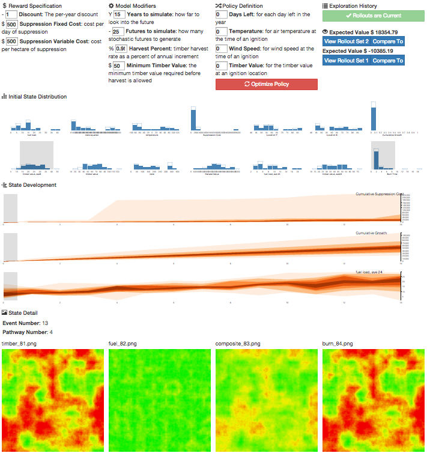

# About

MDPvis is a visualization designed to assist in the MDP simulation and optimization process. See the forthcoming research paper for more details, "Facilitating Testing and Debugging of Markov Decision Processes with Interactive Visualization." To play with a live version of the visualization, visit [mdpvis.github.io/](http://mdpvis.github.io/).

We built MDPvis as a web-based visualization so it would be:

* Easy to integrate with your domain using standard web server libraries
* Easy to share with other people by sharing links to the visualization
* Easy to extend with additional visualization components

The remainder of this document is a guide for interfacing MDPvis with your MDP simulator and optimizer. If you don't want to serve your own instance of MDPvis, you can visit [mdpvis.github.io/](http://mdpvis.github.io/) and skip to the "Bridging MDPvis and Your Domain" section below.

# Serving MDPvis to Your Browser

If you plan on making changes to MDPvis, then you should host MDPvis yourself. Otherwise, we recommend visiting [mdpvis.github.io/](http://mdpvis.github.io/).

If you don't use our hosted version of the MDPvis web application, you will need to serve MDPvis. The simplest way to accomplish this is to follow these steps:

1. [Install Git](https://git-scm.com/book/en/v2/Getting-Started-Installing-Git)
2. Clone MDPvis into your MDP simulator code base, `cd YOUR_SIMULATOR;git clone git@github.com:MDPvis/MDPvis.github.io.git`. You can use a [Git Submodule](https://git-scm.com/book/en/v2/Git-Tools-Submodules) for this if you don't mind figuring out how they work. If you are going to contribute back to MDPvis, you should probably clone your fork of MDPvis.
3. Install [Python 2.7](https://www.python.org/downloads/release/python-279/)
4. Install a few Python libraries with `pip install -U flask-cors`.
5. Navigate into the MDPvis directory and start the server with `python flask_server.py`

At this point the server will start, but it will likely fail because the Flask server expects your MDP simulator to define a file in its code base called `domain_bridge.py`. The next (and final) section helps you define this file.

# Bridging MDPvis and Your Domain

MDPvis interfaces with any MDP simulator+optimizer that is callable by a web server. If you use the web server packages with MDPvis, you can update an example `domain_bridge.py` file found in `example_domain_bridges`, otherwise we recommend viewing the example domain bridges and writing a version of the file as appropriate for your platform.

The bridges take the HTTP requests from the visualization, transforms the query parameters to those expected by the simulator or optimizer, invokes the simulator or optimizer, then returns the results to MDPvis. There are four distinct requests that the bridge should support. We detail these requests below

The visualization expects your code to support the following requests. If your domain is written in Python, we recommend porting one of the example `domain_bridge.py` files to your domain.

## /initialize

The initialize endpoint doesn't query the simulator or optimizer, but it does provide a set of parameters that will influence those systems when requests are made. Here your responsibility is to return a [JSON](http://www.copterlabs.com/blog/json-what-it-is-how-it-works-how-to-use-it/) object listing the:

* Name
* Description
* Current Value
* Minimum Value
* Maximum Value

of each parameter. An example of this data structure in Python is:

    return {
            "reward": [
                        {"name": "Discount",
                         "description":"The per-year discount",
                         "current_value": 1, "max": 1, "min": 0, "units": "~"},
                        {"name": "Suppression Variable Cost",
                         "description":"cost per hectare of suppression",
                         "current_value": 500, "max": 999999, "min": 0, "units": "$"}
                        ],
            "transition": [
                         {"name": "Years to simulate",
                          "description": "how far to look into the future",
                          "current_value": 10, "max": 150, "min": 0, "units": "Y"},
                         {"name": "Harvest Percent",
                          "description": "timber harvest rate as a percent of annual increment",
                          "current_value": 0.95, "max": 1, "min": 0, "units": "%"},
                         {"name": "Minimum Timber Value",
                          "description":"the minimum timber value required before harvest is allowed",
                          "current_value": 50, "max":9999, "min": 0, "units": "$"},
                          {"name": "Growth Model",
                           "description": "set to 1 to use original model; or 2 for updated model.",
                           "current_value": 1, "max":2, "min": 1, "units": "~"}
                         ],
            "policy": [
                        {"name": "Constant",
                         "description":"for the intercept",
                         "current_value": 0, "max": 10, "min":-10, "units": ""},
                        {"name": "Fuel Load 8",
                         "description":"for the average fuel load in the 8 neighboring stands",
                         "current_value": 0, "max": 10, "min":-10, "units": ""},
                        {"name": "Fuel Load 24",
                         "description":"for the average fuel load in the 24 neighboring stands",
                         "current_value": 0, "max": 10, "min":-10, "units": ""}
                      ]
                }

In the MDPvis user interface, each control will be grouped into panels for the reward, model (transition function), and policy.

## /rollouts?QUERY

When requesting Monte Carlo rollouts, MDPvis will send the current set of parameters as defined in the initialization and assigned in the user interface. The job of the domain bridge is to map the parameters of the user interface into parameters to invoke the simulator. After simulations have completed, the data should be JSON serialized. An example of the data in Python is:

    return [
        [
          {"Burn Time": 4.261, "Timber Harvested": 251}, {"Burn Time": 40.261, "Timber Harvested": 0}
        ],
        [
          {"Burn Time": 0.0, "Timber Harvested": 342}, {"Burn Time": 45.261, "Timber Harvested": 20}
        ]
    ]

These data are two rollouts of two states each.

## /optimize?QUERY

MDPvis does not require you to integrate `/optimize` and `/state`, but it is very useful for exploring most problems. Here all the same parameters as are sent to `/rollouts` are sent to `/optimize`, but this query only returns an updated policy. Here is a python example:

    return [
            {"Constant": 10},
            {"Fuel Load 8": 3},
            {"Fuel Load 24": -1}
          ]

## /state?QUERY

This query will be issued when a user clicks an individual rollout in the visualization. All the parameters used to generate the rollout will be sent, with an additional parameter for the rollout number. The expectation is you will use this information to re-generate the rollout and use the simulator to generate descriptive statistics and/or images for the states.

An example of the expected return format is:

    return {
               "images": [
                          ["file_row1_column1.png", "file_row1_column2.png"],
                          ["file_row2_column1.png", "file_row2_column2.png"]]
               "statistics": {
                 "stat 1": 5,
                 "stat 2": -100
               }
           }

# Credits and Contact

If you are having trouble integrating MDPvis, please open an issue on the repository or use one of the contacts found below.

Maintainer: [Sean McGregor](http://seanbmcgregor.com)  
Email: MDPvisGitHubReadme --the at sign-- seanbmcgregor.com  
Maintainer Mailing Address: PO Box 79, Corvallis, OR 97339, United States of America  

Implementation by: Sean McGregor  
With: Hailey Buckingham, Thomas G. Dietterich, Rachel Houtman, Claire Montgomery, and Ronald Metoyer

